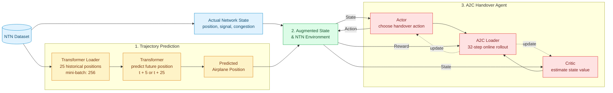

# NTN Handover Reproduction Package

This repository provides a result-level reproduction of **Hybrid Model-Aided Learning for 5G-NTN Handover in High-Mobility Platforms**.

It builds a synthetic 5G-NTN/LEO handover environment, trains Transformer trajectory predictors, and compares Transformer-aided A2C against DQN, random policy, and a vanilla actor-critic ablation. Because the original paper does not publish its exact dataset or code, this project uses a fixed, traceable data pipeline with CelesTrak TLE propagation for paper-sized experiments and a deterministic synthetic constellation for smoke tests.

## Transformer-aided A2C Architecture

The Transformer loader converts 25 historical positions into mini-batches for future-position prediction. A2C learns from a 32-step online rollout collected from `HandoverEnv`, rather than a static dataset or replay buffer. GitHub renders the Mermaid diagram natively, so no additional diagram package is required.

## Get Started

See **[Quick Start](docs/quick_start.md)** for:

- Windows, Linux, and macOS setup
- CPU and NVIDIA CUDA dependency installation
- smoke tests and the complete reproduction pipeline
- individual data, validation, model-training, evaluation, and plotting commands

## Main Outputs

- `artifacts/data/`: generated satellite and airplane features plus provenance metadata
- `artifacts/checkpoints/`: trained Transformer and RL checkpoints
- `artifacts/metrics/`: episode metrics and evaluation summaries
- `artifacts/figures/`: Figure 2/Figure 3-style plots
- [Reproducibility report](docs/reproducibility_report.md): assumptions and result interpretation

## Reproduction Scope

- The goal is trend-level reproduction, not exact point-by-point matching.
- The paper-sized configuration uses 8,441 timesteps at 10-second intervals and dynamically selects 25 high-elevation candidates from a filtered Starlink pool.
- The default action space is `0 = keep` and `1..25 = switch/select satellite`; persistent NORAD IDs define handovers.
- The default reward is `QoS - 0.05 * handover_indicator`.
- Paper-sized runs require CelesTrak/Skyfield propagation and fail instead of silently falling back to incomparable synthetic results.
- `configs/synthetic_smoke.yaml` and `reproduce_all --fast` provide a small deterministic end-to-end check.

For detailed methodology and limitations, see the [reproducibility report](docs/reproducibility_report.md).
