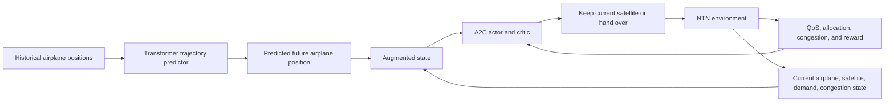

# Detailed Paper Survey: Hybrid Model-Aided Learning for 5G-NTN Handover in High-Mobility Platforms

## 1. Bibliographic Information

| Item | Information |
|---|---|
| Title | *Hybrid Model-Aided Learning for 5G-NTN Handover in High-Mobility Platforms* |
| Authors | Ons Aouedi, Flor Ortiz, Eva Lagunas, Thang X. Vu, and Symeon Chatzinotas |
| Affiliation | Interdisciplinary Centre for Security, Reliability and Trust (SnT), University of Luxembourg |
| Venue | IEEE INFOCOM 2025 Workshops |
| Pages | 1-6 |
| DOI | [10.1109/INFOCOMWKSHPS65812.2025.11152861](https://doi.org/10.1109/INFOCOMWKSHPS65812.2025.11152861) |
| IEEE record | [IEEE Xplore document 11152861](https://ieeexplore.ieee.org/document/11152861) |
| Open author manuscript | [ORBilu PDF](https://orbilu.uni.lu/bitstream/10993/64595/1/HandoverRL_paper.pdf) |
| Publication record | [ORBilu record](https://orbilu.uni.lu/handle/10993/64595) |
| Funding | Luxembourg National Research Fund project SmartSpace, grant C21/IS/16193290 |

Unless otherwise stated, equation, figure, table, and section numbers in this
survey refer to the six-page author manuscript linked above.

### 1.1 Correctness and evidence convention

This survey was re-audited against all six rendered pages of the author
manuscript on 2026-07-28. It uses four labels:

- **Paper-stated:** explicitly printed in the manuscript.
- **Mathematical consequence:** follows from the printed equations, but is not
  necessarily discussed by the authors.
- **Paper ambiguity or inconsistency:** two printed statements conflict, or a
  required definition is missing.
- **Local reconstruction:** a choice made by this repository; it must not be
  attributed to the authors.

"Correct" in this document means faithful reporting with uncertainty preserved.
It does not mean that undisclosed implementation details have been recovered.

## 2. Executive Summary

The paper addresses satellite handover for high-mobility platforms, using
airplanes as its main example. Both the airplanes and Low Earth Orbit (LEO)
satellites move, so a policy based only on the current network state may react
too late to a coverage change. The proposed solution adds predicted airplane
positions to the reinforcement-learning state:

1. A Transformer predicts an airplane position at a future time.
2. The predicted position is combined with current airplane, satellite,
   demand, and congestion information.
3. An Advantage Actor-Critic (A2C) agent chooses whether to retain the current
   satellite or hand over to another available satellite.
4. The reward favors high Quality of Service (QoS) and penalizes handovers.

The central idea is therefore not a new Transformer or a new A2C algorithm.
The contribution is the integration of a model-based trajectory forecast with
a model-free RL handover controller.

The paper reports that:

- the proposed Transformer-assisted A2C policy sharply reduces handovers;
- it obtains higher total reward than DQN and random baselines;
- it reaches average demand satisfaction of 0.82, compared with 0.18 for DQN
  and 0.31 for the random policy;
- an A2C prediction horizon of 25 steps performs better than a horizon of 5;
- A2C performs better than a separately updated actor-critic ablation;
- the horizon-25 configuration takes slightly less reported training time and
  energy than the horizon-5 configuration.

The qualitative idea is reasonable and useful. Exact numerical reproduction is
not currently possible from the paper alone because the dataset, source code,
satellite selection, airplane traces, model architecture, reward coefficients,
episode construction, random seeds, and several other decisive details are not
published.

The current local result mismatch is not evidence that the implemented A2C
gradient is necessarily wrong. The larger, confirmed problems are:

- the paper's critic update, as printed in Equation (18), has the wrong sign for
  squared-error minimization and uses immediate reward where a return or
  bootstrapped target would normally be required;
- the paper's state definition, congestion dynamics, action semantics, and
  multi-airplane resource allocation are internally incomplete;
- the earlier local environment simulated one airplane at a time and made
  satisfaction nearly automatic; the repaired reconstruction now processes all
  airplanes at each timestep and shares satellite capacity;
- the paper's reward plot cannot be produced from the disclosed bounded QoS
  reward without missing coefficients, aggregation, or additional scaling.

## 3. Research Problem

### 3.1 Why LEO handover is difficult

LEO satellites move rapidly relative to the Earth, and a high-mobility terminal
such as an airplane also changes position continuously. This produces a
time-varying set of visible satellites and frequent changes in:

- satellite elevation angle;
- link quality;
- available satellite capacity;
- congestion;
- expected connection duration;
- the best satellite for the terminal.

Poor handover decisions may cause:

- temporary loss of connectivity;
- higher latency;
- degraded QoS;
- excessive signaling;
- resource imbalance;
- unnecessary repeated handovers.

### 3.2 Limitation attributed to earlier methods

The paper groups prior work into heuristic, Q-learning, DQN, and multi-agent RL
approaches. Its main criticism is that these approaches typically act on
instantaneous state and do not explicitly integrate a forecast of the
high-mobility platform's future trajectory.

The claimed research gap is:

> Existing RL handover controllers are reactive, while a high-mobility NTN
> controller should be proactive.

### 3.3 Optimization objective

The desired handover policy must balance competing goals:

- maximize QoS;
- satisfy airplane communication demand;
- avoid congested satellites;
- maintain feasible elevation angles;
- reduce unnecessary satellite switching;
- retain awareness of future airplane movement.

The paper expresses this balance through an RL reward rather than a
fully specified constrained optimization program.

## 4. Main Contributions

The paper claims the following contributions.

### 4.1 Predictive handover state

A Transformer learns airplane trajectory dynamics from historical positions.
Its future-position prediction is added to the RL state.

### 4.2 Hybrid model-aided controller

The paper combines:

- a supervised predictive component, the Transformer; and
- a model-free control component, the A2C agent.

The prediction model supplies foresight; the RL model converts that foresight
into a handover decision.

### 4.3 Joint QoS and handover objective

The handover policy is trained using a reward that increases with QoS and
decreases when a handover is performed.

### 4.4 Experimental comparison

The proposed method is compared with:

- DQN without a predictive component;
- a random policy;
- a vanilla actor-critic ablation with prediction;
- A2C with prediction horizons of 5 and 25 steps.

### 4.5 Efficiency reporting

The paper additionally reports training time and energy cost for actor-critic,
A2C horizon 5, and A2C horizon 25.

## 5. Conceptual Framework

Figure 1 shows the following control loop.

The operational sequence implied by the paper is:

1. Collect recent airplane positions.
2. Predict the airplane position at a selected future horizon.
3. Collect current satellite positions, elevation, congestion, demand, and
   related network state.
4. Construct an augmented state containing the current and predicted
   information.
5. Use the actor to produce a probability distribution over handover actions.
6. Apply the selected action.
7. Calculate allocation, QoS, handover cost, and reward.
8. Use the critic and advantage estimate to update the policy.
9. Repeat at the next decision time.

## 6. Notation

| Symbol | Meaning |
|---|---|
| \(N\) | Number of LEO satellites |
| \(K\) | Number of airplanes in the trajectory-training dataset |
| \(M\) | Number of airplanes used in an episode-level satisfaction average |
| \(T\) | Number of timesteps in an episode or return horizon, depending on context |
| \(E\) | Number of evaluation episodes |
| \(k\) | Airplane index |
| \(n\) | Satellite index |
| \(t\) | Current timestep |
| \(l\) | Historical window length and future prediction offset in Eqs. (7)-(9) |
| \(\mathrm{SatPos}_{n,t}\) | Latitude, longitude, and altitude of satellite \(n\) |
| \(\mathrm{PlanePos}_{k,t}\) | Latitude, longitude, and altitude of airplane \(k\) |
| \(\widehat{\mathrm{PlanePos}}_{k,t+l}\) | Transformer prediction of the airplane's future position |
| \(\theta_{k,n,t}\) | Elevation angle between airplane \(k\) and satellite \(n\) |
| \(\theta_{\min}\) | Minimum feasible elevation angle, reported as 20 degrees |
| \(\theta_{\max}\) | Maximum/reference elevation used to normalize QoS |
| \(\mathrm{cong}_{n,t}\) | Congestion or used-capacity fraction of satellite \(n\) |
| \(\mathrm{dem}_{k,t}\) | Communication demand of airplane \(k\) |
| \(\mathrm{alloc}_{k,n,t}\) | Satellite resource allocated to airplane \(k\) |
| \(\mathrm{QoS}_{k,n,t}\) | QoS for airplane \(k\) using satellite \(n\) |
| \(s_t\), \(S_{k,t}\) | RL state |
| \(a_t\), \(a_{k,t}\) | Handover action |
| \(\pi_\theta\) | Actor policy |
| \(V_\phi\) | Critic state-value estimate |
| \(A(s_t,a_t)\) | Advantage estimate |
| \(\gamma\) | Reward discount factor |
| \(\alpha,\beta\) | QoS and handover reward weights in Eq. (14); later reused as learning-rate symbols |

## 7. System Model

### 7.1 Satellite model

The network contains \(N\) LEO satellites. The position of satellite \(n\) at
time \(t\) is:

\[
\mathrm{SatPos}_{n,t}
=
\{\mathrm{lat}_{n,t},\mathrm{lon}_{n,t},\mathrm{alt}_{n,t}\}.
\]

Satellite orbits are predetermined. In the experiment, satellite trajectories
are propagated from CelesTrak Two-Line Element (TLE) data.

Each satellite has:

- a time-varying position;
- a coverage region determined by altitude and antenna pointing;
- a normalized congestion value in \([0,1]\);
- limited communication capacity.

The paper assumes Earth-moving beams that follow an airplane's position.

### 7.2 Coverage model

Satellite \(n\) can serve airplane \(k\) only when:

\[
\theta_{k,n,t} \geq \theta_{\min}.
\]

The reported minimum elevation is:

\[
\theta_{\min}=20^\circ.
\]

The visible/covering set for airplane \(k\) is:

\[
\mathrm{CoverSat}_{k,t}\subseteq\{1,2,\ldots,N\}.
\]

Multiple satellites may simultaneously cover the same airplane.

### 7.3 Airplane model

The terminal set contains high-mobility airplanes. Airplane \(k\)'s position is:

\[
\mathrm{PlanePos}_{k,t}
=
\{\mathrm{lat}_{k,t},\mathrm{lon}_{k,t},\mathrm{alt}_{k,t}\}.
\]

Its demand is:

\[
\mathrm{dem}_{k,t}\in[d_{\min},d_{\max}].
\]

In the experiment:

\[
d_{\min}=0.2,\qquad d_{\max}=0.5.
\]

Demand is interpreted as the fraction of a satellite's normalized capacity
required by the airplane.

### 7.4 Resource allocation

Equation (1) defines allocation as:

\[
\mathrm{alloc}_{k,n,t}
=
\min\left(
\mathrm{dem}_{k,t},
1-\mathrm{cong}_{n,t}
\right).
\]

This means an airplane receives either:

- its complete demand, when sufficient capacity is available; or
- all remaining satellite capacity, when demand exceeds availability.

### 7.5 Congestion update

Equation (2) states:

\[
\mathrm{cong}_{n,t+1}
=
\mathrm{cong}_{n,t}
+
\mathrm{alloc}_{k,n,t}.
\]

This update models the admission of a new airplane as increased satellite
utilization.

**Paper ambiguity or inconsistency:** Equations (1), (2), and (5) do not form a
complete multi-airplane allocator.

- Equation (1) allocates independently to one airplane using all remaining
  capacity. Applying it simultaneously to several airplanes can violate
  \(\sum_k\mathrm{alloc}_{k,n,t}\leq1\).
- Equation (2) contains one \(k\) on its right-hand side but does not specify
  which airplane is admitted first or whether allocations are summed.
- If \(\mathrm{cong}_{n,t}\) already represents capacity used by other traffic,
  new allocations should satisfy
  \(\sum_k\mathrm{alloc}_{k,n,t}\leq1-\mathrm{cong}_{n,t}\), not merely
  Equation (5)'s bound of 1.
- No resource release, session completion, congestion decay, reset, or clipping
  rule is specified. Repeated positive updates can therefore exceed 1 even
  though congestion was defined on \([0,1]\).

A valid implementation needs an explicitly ordered sequential allocator or a
joint capacity-allocation rule. The paper provides neither.

### 7.6 QoS model

Equation (3) combines elevation, demand satisfaction, and congestion:

\[
\mathrm{QoS}_{k,n,t}
=
\left(\frac{\theta_{k,n,t}}{\theta_{\max}}\right)^{1.5}
\left(
\frac{\mathrm{alloc}_{k,n,t}+0.1}
{\mathrm{dem}_{k,t}+0.1}
\right)
\left(1-\mathrm{cong}_{n,t}\right).
\]

Interpretation:

- the exponent \(1.5\) gives more weight to high-elevation links;
- the allocation ratio rewards satisfying airplane demand;
- adding 0.1 reduces sensitivity to small allocation/demand values and avoids
  numerical problems;
- \(1-\mathrm{cong}_{n,t}\) favors less congested satellites.

**Paper ambiguity or inconsistency:**

- \(\theta_{\max}\) is never assigned a numerical value.
- The fractional power is not real-valued for a negative elevation angle, so
  Equation (3) must only be evaluated after enforcing coverage, or its elevation
  term must be clipped. The paper does not state the evaluation order.
- The prose describes congestion after admitting the new user, while Equation
  (3) uses the pre-update \(\mathrm{cong}_{n,t}\).
- The added 0.1 prevents a zero denominator, but it also means the middle factor
  is not exactly the demand-satisfaction ratio.

Equation (4) clips QoS:

\[
\mathrm{QoS}_{k,n,t}
\leftarrow
\min\left(
\max(\mathrm{QoS}_{k,n,t},0),
1
\right).
\]

### 7.7 Handover mechanism

At each decision time, an airplane may:

- keep the current satellite connection; or
- switch to another satellite in its current coverage set.

The decision should consider:

- predicted future airplane position;
- future coverage changes;
- current and expected QoS;
- satellite capacity and congestion;
- the penalty for unnecessary handovers.

### 7.8 Constraints

The resource-capacity constraint is:

\[
\sum_k \mathrm{alloc}_{k,n,t}\leq 1,\qquad \forall n,t.
\]

The elevation constraint is:

\[
\theta_{k,n,t}\geq\theta_{\min},\qquad \forall k,n,t
\]

for any selected/serving link.

The paper states these constraints but does not specify how the RL action is
masked, projected, rejected, or penalized when a constraint is violated.

## 8. Transformer Trajectory Predictor

### 8.1 Input sequence

For airplane \(k\), Equation (7) uses:

\[
\mathcal{X}_k
=
\{
\mathrm{PlanePos}_{k,t-l},
\ldots,
\mathrm{PlanePos}_{k,t}
\}.
\]

This sequence contains historical latitude, longitude, and altitude values.

**Paper ambiguity:** the inclusive sequence from \(t-l\) through \(t\) contains
\(l+1\) positions, although the text calls \(l\) the number of historical
timesteps. The same \(l\) is also used as the future prediction offset. History
length and forecast horizon are therefore coupled in Equations (7)-(9), while
the experiments discuss horizons 5 and 25 without reporting the corresponding
history-window length.

### 8.2 Output

Equation (8) predicts one future position:

\[
\widehat{\mathrm{PlanePos}}_{k,t+l}
=
f_\vartheta(\mathcal{X}_k).
\]

This is an important implementation detail. The stated model predicts the
position at the selected horizon, not necessarily every intermediate
trajectory point between \(t\) and \(t+l\).

### 8.3 Objective

Equation (9) uses Mean Squared Error:

\[
\mathcal{L}
=
\frac{1}{K}
\sum_{k=1}^{K}
\left\|
\widehat{\mathrm{PlanePos}}_{k,t+l}
-
\mathrm{PlanePos}_{k,t+l}
\right\|^2.
\]

The paper says the parameters are optimized with backpropagation.

Equation (9) averages over airplanes \(K\) at one implicit time index. It does
not define averaging over trajectory windows or timesteps. A practical training
loss must additionally define the set of samples and its split; those details
are absent.

### 8.4 Why a Transformer is used

The authors identify three advantages:

- self-attention can weight the most relevant historical positions;
- attention can model long-term trajectory dependencies;
- Transformer training can be parallelized more easily than sequential RNN or
  LSTM processing.

### 8.5 Missing architecture details

The paper does not report:

- input normalization;
- history length other than the ambiguous \(l\);
- embedding dimension;
- number of attention heads;
- number of Transformer layers;
- feed-forward width;
- positional encoding;
- dropout;
- optimizer type;
- number of Transformer epochs;
- learning-rate schedule;
- train/validation/test split;
- early stopping;
- trajectory prediction RMSE or geographic distance error.

The absence of a standalone prediction-accuracy result makes it impossible to
determine how much of the RL gain comes from accurate forecasting versus other
implementation differences.

## 9. A2C Handover Agent

### 9.1 Actor

The actor represents:

\[
\pi_\theta(a_t\mid s_t)
=
\operatorname{softmax}(f_\theta(s_t)).
\]

It outputs a probability distribution over all handover actions.

### 9.2 Action space

The action-space size is:

\[
N+1.
\]

The paper describes:

- one action for retaining the current connection; and
- one action for switching/selecting each of the \(N\) satellites.

Only covered satellites should be feasible handover targets, although the
paper does not describe the exact masking method.

Equation (15) defines every nonzero action as a handover. This is ambiguous
because the \(N+1\) action design also appears to include a satellite-selection
action for the satellite that is already connected. Either that duplicate
action must be masked, or the physically correct indicator is:

\[
H_t=\mathbb{1}\{\mathrm{selected\ satellite\ ID}_t
\neq\mathrm{connected\ satellite\ ID}_{t-1}\}.
\]

This identity-based expression is a reconstruction, not an equation printed in
the paper.

### 9.3 Critic

The critic estimates:

\[
V_\phi(s_t)
=
\mathbb{E}
\left[
\sum_{j=0}^{\infty}
\gamma^j R(s_{t+j},a_{t+j})
\mid s_t,\pi
\right].
\]

This estimate provides a baseline for reducing policy-gradient variance.

### 9.4 Advantage

Equation (12) defines:

\[
A(s_t,a_t)
=
Q(s_t,a_t)-V_\phi(s_t).
\]

Positive advantage indicates that an action performed better than the critic's
expected value for the state.

### 9.5 Augmented state

Equation (13) gives:

\[
S_{k,t}
=
\left(
\mathrm{PlanePos}_{k,t},
\widehat{\mathrm{PlanePos}}_{k,t+l},
\mathrm{dem}_{k,t},
\mathrm{SatPos}_{n,t},
\mathrm{cong}_{n,t}
\right).
\]

The surrounding prose additionally says the state includes:

- satellite elevation angles; and
- historical QoS metrics.

This creates a specification mismatch: elevation and historical QoS appear in
the prose but not in Equation (13). Conversely, Equation (13) includes
satellite positions, while the prose list emphasizes elevation angles. The
unquantified satellite index \(n\) also leaves unclear whether the state
contains one satellite, all \(N\) satellites, or only currently covered
satellites.

### 9.6 Reward

Equation (14) defines:

\[
R(s_t,a_t)
=
\alpha\,\mathrm{QoS}_{k,n,t}
-
\beta\,H(a_{k,t}).
\]

The handover indicator in Equation (15) is:

\[
H(a_{k,t})
=
\begin{cases}
1,&a_{k,t}\neq 0,\\
0,&a_{k,t}=0.
\end{cases}
\]

The reward therefore trades QoS against handover frequency.

The paragraph introducing Equation (14) also says low elevation angles are
penalized. There is no separate low-elevation penalty in the printed reward;
elevation affects reward only indirectly through QoS.

**Mathematical consequence:** if \(\alpha,\beta\geq0\), QoS is clipped to
\([0,1]\), and \(H\in\{0,1\}\), then:

\[
-\beta\leq R(s_t,a_t)\leq\alpha.
\]

For an episode of \(T\) transitions, the undiscounted sum must lie between
\(-T\beta\) and \(T\alpha\) per controlled airplane. The approximately
\(-600{,}000\) values in the paper's plots therefore require undisclosed large
weights, aggregation across many decisions, additional penalties, or another
reward scale.

### 9.7 Discounted objective

Equation (16) maximizes:

\[
G
=
\mathbb{E}
\left[
\sum_{t=0}^{T}
\gamma^tR(s_t,a_t)
\right].
\]

### 9.8 Reported updates

The actor update in Equation (17) is:

\[
\theta
\leftarrow
\theta
+
\alpha
\nabla_\theta
\log\pi_\theta(a_t\mid s_t)
A(s_t,a_t).
\]

The critic update is printed in Equation (18) as:

\[
\phi
\leftarrow
\phi
+
\beta
\nabla_\phi
\left(
R(s_t,a_t)-V_\phi(s_t)
\right)^2.
\]

There are two important issues:

1. \(\alpha\) and \(\beta\) were already used as reward-scaling coefficients in
   Equation (14), then reused as actor and critic learning-rate symbols.
2. The printed critic update uses gradient ascent on squared error. Standard
   value learning minimizes this error, so the sign should normally be
   negative or the equation should explicitly define ascent on a negative
   loss.

3. The text says the critic fits an "observed return," but Equation (18) uses
   only \(R(s_t,a_t)\). A value function for the discounted objective normally
   uses a Monte Carlo return or a bootstrapped target such as
   \(R_t+\gamma V_\phi(s_{t+1})\). Immediate reward alone is not the value target
   defined in Equation (11).

A mathematically consistent one-step form is:

\[
\delta_t=R_t+\gamma(1-d_t)V_\phi(s_{t+1})-V_\phi(s_t),
\]

\[
\theta\leftarrow\theta+
\eta_\pi\nabla_\theta\log\pi_\theta(a_t\mid s_t)\,
\operatorname{stopgrad}(\delta_t),
\]

\[
\phi\leftarrow\phi-\eta_V\nabla_\phi\frac{1}{2}
\left(R_t+\gamma(1-d_t)V_{\phi^-}(s_{t+1})-V_\phi(s_t)\right)^2.
\]

Here \(\eta_\pi\) and \(\eta_V\) avoid colliding with the reward weights, \(d_t\)
is the terminal indicator, and the bootstrap target is treated as constant
during the critic update. An n-step return is also valid and is closer to the
OpenAI Baselines A2C implementation cited by the paper.

### 9.9 What "A2C" means here

The paper emphasizes synchronous policy and value updates. It contrasts the
A2C model with a vanilla actor-critic model whose actor and critic are updated
separately. A2C is itself an actor-critic algorithm; "A2C versus actor-critic"
is therefore not a complete algorithmic distinction. In the cited
[OpenAI Baselines A2C implementation](https://github.com/openai/baselines/blob/master/baselines/a2c/a2c.py),
vectorized environments collect n-step batches and a joint loss combines
policy loss, value loss, and entropy. The paper does not state whether it used
that implementation or only cited it for the general method.

However, it does not specify:

- number of parallel environments/workers;
- n-step rollout length;
- Generalized Advantage Estimation;
- entropy regularization;
- value-loss coefficient;
- gradient clipping;
- return normalization;
- optimizer;
- network architecture;
- whether actor and critic share a feature encoder.

Consequently, several technically different implementations could all satisfy
the textual description.

## 10. Experimental Setup

### 10.1 Explicitly reported values

| Parameter | Reported value |
|---|---:|
| Dataset instances | 8,441 |
| Dataset features | 256 |
| Time interval | 10 seconds |
| Satellites | 25 |
| Satellite source | CelesTrak TLE |
| Minimum elevation | 20 degrees |
| Learning rate | 0.0001 |
| Batch size | 256 |
| Minimum normalized demand | 0.2 |
| Maximum normalized demand | 0.5 |
| Compared prediction horizons | 5 and 25 steps |
| Training-curve episodes visible in figures | 300 |

At 10-second spacing, 8,441 instances span approximately:

\[
(8441-1)\times10=84{,}400\text{ seconds}
\]

or about 23 hours and 26 minutes from the first to last timestamp if the
instances form one uninterrupted trace.

This duration is inferred from the instance count and interval. The paper does
not explicitly state that all rows form one continuous trace.

### 10.2 Reported feature categories

The 256 features are said to include:

- timestamps;
- 25 satellites;
- satellite latitude;
- satellite longitude;
- satellite altitude;
- satellite elevation;
- satellite congestion;
- airplane positions;
- covering-satellite information;
- airplane demand.

The exact column schema is not given. A direct count from the description does
not uniquely yield 256 because the number of airplanes, encoding of coverage,
and feature grouping are unspecified.

### 10.3 Centralized controller

The DRL agent is deployed at a central entity that:

- gathers satellite and airplane data;
- predicts airplane positions;
- constructs the RL state;
- computes handover decisions.

The communication latency, signaling delay, inference time, and scalability of
this centralized entity are not evaluated.

### 10.4 Baselines

The main comparison includes:

1. Proposed Transformer-assisted A2C.
2. DQN without future-position predictions.
3. Random policy without future-position predictions.

The ablation study includes:

1. A2C with horizon 5.
2. A2C with horizon 25.
3. Vanilla actor-critic with horizon 5 and the predictive component retained.

The paper does not publish baseline network sizes or demonstrate that all
methods received equal tuning budgets.

## 11. Evaluation Metrics

### 11.1 Number of handovers

The handover count measures connection stability and signaling load. Lower is
better, provided QoS and demand satisfaction remain acceptable.

### 11.2 Total reward

Total reward combines QoS and handover cost according to Equation (14). Higher
is better.

The paper alternates between "total reward" and "cumulative total reward."
The exact aggregation across timesteps, airplanes, and episodes is not
specified.

### 11.3 Airplane demand satisfaction

Equation (19) defines per-airplane episode satisfaction:

\[
S_k
=
\frac{1}{T}
\sum_{t=1}^{T}
\frac{\mathrm{alloc}_{k,n,t}}
{\mathrm{dem}_{k,t}}
\]

when demand is positive, and zero otherwise.

Equation (20) averages across \(M\) airplanes:

\[
\overline{S}_e
=
\frac{1}{M}
\sum_{k=1}^{M}S_k.
\]

Equation (21) averages across \(E\) episodes:

\[
\mathrm{Final\ Satisfaction}
=
\frac{1}{E}
\sum_{e=1}^{E}\overline{S}_e.
\]

This is the paper's clearest multi-level evaluation definition.

### 11.4 Convergence

Convergence speed is interpreted visually from reward curves. No numerical
convergence threshold, sample-efficiency measure, or confidence interval is
reported.

### 11.5 Training time and energy

The paper reports wall-clock training time in seconds and energy cost in Wh.
It does not explain:

- hardware;
- software environment;
- measurement tool;
- whether CPU, GPU, memory, and cooling are included;
- sampling interval;
- idle-power subtraction;
- whether Transformer pretraining is included.

## 12. Reported Results

### 12.1 Figure 2a: handovers

The figure compares handover counts over 300 episodes.

Approximate visual reading:

- the proposed framework begins with a high handover count and falls rapidly
  toward nearly zero by roughly episode 50;
- DQN remains around the low-to-mid 2,000 range;
- the random policy remains around the mid-to-high 3,000 range;
- random has the highest handover frequency;
- the proposed method exhibits the strongest apparent convergence.

Only the qualitative ordering is reliable because the paper provides no raw
data or exact numerical table for this figure.

### 12.2 Figure 2b: total reward

Approximate visual reading:

- the proposed framework starts with a large negative reward and rapidly rises
  to a small positive or near-zero plateau;
- DQN remains around approximately \(-500{,}000\);
- random remains lower, around approximately \(-580{,}000\);
- the proposed method clearly dominates after early training.

The reward magnitude cannot be reconstructed from the published equations
because \(\alpha\), \(\beta\), episode aggregation, and any additional
penalties or scaling are not reported.

### 12.3 Figure 2c: demand satisfaction

The paper provides exact labels:

| Method | Average demand satisfaction |
|---|---:|
| Proposed framework | 0.82 |
| DQN | 0.18 |
| Random | 0.31 |

The proposed framework improves satisfaction by:

- 0.64 absolute over DQN;
- 0.51 absolute over random.

Relative ratios are approximately:

- \(0.82/0.18\approx4.56\) times DQN;
- \(0.82/0.31\approx2.65\) times random.

The paper does not report uncertainty, multiple-seed variation, or statistical
significance.

### 12.4 Figure 3: horizon and RL ablation

The paper concludes:

- A2C with horizon 25 performs better than A2C with horizon 5;
- both A2C variants outperform vanilla actor-critic;
- A2C converges faster;
- a longer horizon improves stable satellite selection and anticipation of
  coverage changes.

Important editorial inconsistency: Figure 3's y-axis is Total Reward, but its
caption says the figure shows the impact on handovers.

### 12.5 Table I: training time and energy

| Model | Energy cost (Wh) | Training time (s) | Training time (hours) |
|---|---:|---:|---:|
| Actor-Critic | 0.161 | 11,796 | 3.277 |
| Proposed, horizon 5 | 0.177 | 12,981 | 3.606 |
| Proposed, horizon 25 | 0.169 | 12,404 | 3.446 |

The paper's interpretation is:

- vanilla actor-critic is cheapest and fastest;
- horizon 25 is slightly cheaper and faster than horizon 5;
- horizon 25 allegedly converges faster despite its longer prediction offset;
- the efficiency advantage of vanilla actor-critic does not compensate for
  its lower reward and handover performance.

The energy figures require clarification. Dividing each reported Wh value by
its training duration gives an average power close to 0.049 W for every model:

| Model | Implied average power |
|---|---:|
| Actor-Critic | about 0.049 W |
| Proposed, horizon 5 | about 0.049 W |
| Proposed, horizon 25 | about 0.049 W |

This is implausibly low for multi-hour neural-network training. Possible
explanations include:

- the unit should be kWh rather than Wh;
- only a narrow component was measured;
- a unit conversion is missing;
- the energy values were derived from a fixed assumed power rather than full
  system measurement.

The paper does not provide enough information to decide which explanation is
correct.

## 13. Interpretation of Why the Method Can Work

### 13.1 Reactive DQN limitation

A DQN that only sees current geometry may select the satellite with the best
instantaneous value even when that satellite will soon leave coverage.

### 13.2 Predictive-state advantage

With \(\widehat{\mathrm{PlanePos}}_{k,t+l}\), the A2C policy can learn patterns
such as:

- avoid a satellite that will soon have a poor elevation angle;
- prefer a satellite likely to remain visible longer;
- tolerate a slightly lower current QoS to prevent an imminent handover;
- distribute demand toward satellites expected to remain available.

### 13.3 Why horizon 25 may outperform horizon 5

At 10-second intervals:

- horizon 5 corresponds to approximately 50 seconds;
- horizon 25 corresponds to approximately 250 seconds.

This conversion assumes that "horizon" counts dataset steps.

A 250-second forecast may provide enough lead time to learn connection
persistence, whereas a 50-second forecast may still be too short for proactive
selection.

### 13.4 Longer-horizon risk

A longer horizon is not automatically better. Prediction error usually grows
with forecast distance. The paper does not report prediction error at horizons
5 and 25, so it does not quantify the trade-off between:

- more planning lead time; and
- less accurate future positions.

## 14. Strengths

### 14.1 Clear practical motivation

The paper targets a concrete NTN mobility problem with direct QoS and signaling
implications.

### 14.2 Interpretable hybrid architecture

The two-stage design has a clear division of responsibility:

- the Transformer estimates future mobility;
- A2C selects the handover action.

### 14.3 Physically meaningful state

The proposed state includes position, elevation, demand, congestion, and future
trajectory information rather than treating the environment as an abstract
control task.

### 14.4 Multi-objective reward

The QoS-minus-handover formulation captures the central operational trade-off.

### 14.5 Useful ablations

The comparison between:

- horizon 5 and horizon 25; and
- A2C and vanilla actor-critic

directly examines the two main design choices.

### 14.6 Efficiency is at least considered

Many networking ML papers omit training cost entirely. This paper attempts to
report both time and energy, even though the measurement method is missing.

## 15. Weaknesses and Reproducibility Gaps

### 15.1 No public code or dataset

The paper and its publication record provide the manuscript but no official
implementation or packaged dataset.

### 15.2 Dataset schema is incomplete

"8,441 instances with 256 features" is not enough to reconstruct:

- feature ordering;
- number of airplanes;
- missing-value handling;
- categorical/boolean encoding;
- normalization;
- train/test split;
- satellite selection;
- airplane trajectory source.

### 15.3 TLE experiment is not pinned

The paper does not identify:

- TLE retrieval date;
- TLE file hash;
- the 25 satellite catalog numbers;
- orbit-propagation start time;
- time scale;
- SGP4/Skyfield version;
- satellite-selection rule.

TLE data changes over time, so "CelesTrak TLE" alone is not a reproducible
dataset definition.

### 15.4 Coverage continuity is assumed rather than demonstrated

The paper mentions Earth-moving beams and continuous connectivity but does not
report:

- percentage of airplane-timesteps with no visible satellite;
- average number of visible satellites;
- outage duration;
- coverage distribution by airplane.

These quantities strongly affect handover feasibility.

### 15.5 Transformer specification is insufficient

The architecture and prediction accuracy are not reported. This prevents an
independent reviewer from evaluating the supervised-learning component.

### 15.6 RL specification is insufficient

Missing details include:

- actor and critic architectures;
- \(\alpha\), \(\beta\), and \(\gamma\);
- optimizer;
- entropy coefficient;
- n-step return length;
- number of workers;
- replay or on-policy collection details;
- constraint handling;
- episode length;
- termination conditions;
- number of random seeds.

### 15.7 Reward scale is unexplained

The very large negative values in Figures 2b and 3 cannot be interpreted from
the published reward equation without the missing coefficients and aggregation
definition.

### 15.8 No statistical reporting

The figures show single curves without:

- mean across seeds;
- standard deviation;
- confidence intervals;
- significance tests.

The improvements may be real, but their variability is unknown.

### 15.9 Congestion dynamics are incomplete

Equation (2) only increases congestion, can exceed its declared \([0,1]\)
domain, and does not specify how multiple \(k\) allocations are combined. A
realistic system requires ordered/joint allocation plus resource release,
traffic completion, time variation, or another load process.

### 15.10 State definition is inconsistent

The prose includes elevation and historical QoS, while Equation (13) omits
them.

### 15.11 Update notation is ambiguous

The same symbols \(\alpha\) and \(\beta\) denote both reward weights and
learning rates. The printed critic-gradient sign is wrong for loss
minimization unless an omitted negative loss is intended, and its immediate
reward target is inconsistent with the value function in Equation (11).

### 15.12 Handover action semantics are ambiguous

Equation (15) equates every nonzero satellite-selection action with a handover,
even if that action selects the already connected satellite. The paper does not
state whether this duplicate selection is masked.

### 15.13 Baseline fairness is unclear

The paper does not state whether:

- DQN and A2C have similar parameter counts;
- all methods receive equal training interactions;
- hyperparameters are tuned equally;
- baselines receive identical non-predictive state features.

### 15.14 Limited external validity

The evaluation covers one undisclosed scenario. It does not vary:

- constellation density;
- airplane routes;
- satellite altitude/shell;
- elevation threshold;
- demand distribution;
- congestion intensity;
- prediction noise;
- TLE errors;
- signaling delay;
- handover execution delay.

## 16. Threats to Validity

### 16.1 Internal validity

Observed gains may be affected by undocumented differences in architecture,
training budget, feature access, or hyperparameter tuning.

### 16.2 Construct validity

The QoS formula is a normalized surrogate, not a full radio-link model. It does
not explicitly include:

- path loss;
- antenna gain;
- SINR;
- interference;
- fading;
- Doppler;
- propagation delay;
- handover interruption time.

### 16.3 External validity

Results from one airplane/satellite trace may not generalize to other orbital
shells, routes, traffic profiles, or NTN deployments.

### 16.4 Statistical conclusion validity

Without multiple seeds or uncertainty, the reliability and magnitude of the
reported improvement cannot be assessed.

## 17. Reproducibility Assessment

| Component | Reproducibility | Reason |
|---|---|---|
| High-level research question | High | Clearly described |
| System entities | High | Satellites, airplanes, demand, congestion are defined |
| Allocation and QoS equations | Medium | Printed explicitly, but multi-user allocation, congestion update, and QoS evaluation order are incomplete |
| Constraints | Low | Equation (1) does not guarantee Equation (5), and enforcement is not specified |
| Transformer concept | Medium | Input, output, and MSE are given |
| Transformer implementation | Low | Architecture and data split are absent |
| RL state/action concept | Medium | Main components are described |
| A2C implementation | Very low | Network and rollout details are absent; printed critic update is not mathematically consistent |
| Reward equation | Medium | Form and bound are clear, but coefficients, aggregation, and action identity semantics are absent |
| Dataset | Low | No file, schema, trajectories, or TLE snapshot |
| Baseline implementation | Low | Architectures and tuning are absent |
| Demand satisfaction | Medium | Eqs. (19)-(21) are explicit, but serving-satellite indexing and concurrent allocation are not |
| Exact figures | Low | No raw values, seeds, or aggregation details |
| Training time | Low | Hardware and measurement method absent |
| Energy cost | Very low | Unit/method appear incomplete |

Overall assessment:

- framework-level reproduction: feasible;
- qualitative trend reproduction: feasible with documented assumptions;
- exact numerical reproduction: not defensible from the paper alone.

## 18. Mapping to This Repository

This section describes the local implementation as audited on 2026-07-28.

| Paper component | Repository location | Current interpretation |
|---|---|---|
| Dataset and TLE acquisition | `ntn_repro/data.py` | Downloads, caches, validates, and propagates CelesTrak TLE |
| Frozen TLE recovery snapshot | `configs/celestrak_starlink_2026-07-24.tle` | Earlier 25-record snapshot retained for audit/recovery; it is not the current dynamic candidate pool |
| Paper configuration | `configs/paper_result.yaml` | Requires CelesTrak provenance and prohibits synthetic fallback |
| Geometry/elevation | `ntn_repro/geometry.py` | Converts positions and calculates elevation |
| Allocation, QoS, reward, action mask | `ntn_repro/env.py` | Processes all airplanes per physical timestep, applies Eq. (1), reserves shared satellite capacity, computes Eqs. (3)-(4), and applies the Eq. (14) reward |
| Transformer | `ntn_repro/models.py` | Encoder predicts one position at the selected horizon |
| Transformer training | `ntn_repro/train_transformer.py` | Builds historical windows and future-position MSE targets |
| A2C, actor-critic, DQN, random | `ntn_repro/train_rl.py` | Trains the proposed and baseline agents |
| Independent evaluation | `ntn_repro/evaluate.py` | Evaluates checkpoints over configured seeds and episodes |
| Figures | `ntn_repro/plot.py` | Produces Figure 2/3-style outputs |
| Alignment audit | `docs/paper_alignment_audit.md` | Records confirmed matches, deviations, and artifact evidence |

### 18.1 Confirmed local CelesTrak provenance

The current rebuilt metadata reports:

- source: `celestrak_tle_cache_skyfield`;
- selection mode: `dynamic_top_elevation`;
- 1,585 TLE records in the 500-600 km candidate pool;
- 25 candidate slots per airplane-timestep;
- TLE SHA-256:
  `1c70a93aab7f3034af97ea250bfdf46d2f79ca2689dbcfb75cff99f156a4d20d`;
- provenance validation: passed.

### 18.2 Major remaining local geometry mismatch

The latest fixed-first-25 TLE subset leaves approximately 86.78% of
airplane-timesteps without a visible satellite at the 20-degree threshold.

This is not a synthetic-orbit problem. It is now a satellite-subset and
scenario-geometry problem. The paper does not disclose which 25 Starlink
satellites were used, so choosing a favorable subset would be an additional
reproduction assumption that must be documented.

### 18.3 Best-effort repaired satellite-selection assumption

While awaiting clarification from the authors, the paper-result configuration
uses a clearly labeled repaired reconstruction:

- parse the full available CelesTrak Starlink TLE set;
- retain a stable 500-600 km shell as a proxy for operational satellites,
  excluding the low-altitude records that appear first in the catalog while
  lowering or decaying;
- at every airplane-timestep, expose the 25 satellites with the highest
  current elevation;
- preserve the NORAD catalog ID separately from the candidate-slot index, so a
  slot reorder is not counted as a handover;
- keep the paper's 20-degree minimum elevation unchanged.

This dynamic candidate interpretation is not stated by the paper. It is the
best-effort repair that reconciles the 25-dimensional candidate/action
interface with the paper's continuous-connectivity assumption and reported
0.82 average demand satisfaction. The original fixed-first-25 result remains
evidence that an arbitrary catalog prefix is not a meaningful constellation.

The current metadata, rebuilt at `2026-07-28T04:20:13.686443+00:00` with
propagation pinned to `2026-07-27T12:00:00+00:00`, reports zero no-visible
airplane-timesteps and an average of 11.557 visible candidates
at the unchanged 20-degree threshold. These are local reconstruction
measurements, not paper results.

### 18.4 Remaining implementation differences

The local repository still cannot exactly match the paper because:

- airplane routes are synthetic;
- the local stored feature count does not reproduce the unexplained 256-column
  schema;
- satellite selection is not recoverable from the paper;
- the paper's exact congestion process is unknown;
- the paper's multi-airplane allocation order is unknown;
- the paper's reward weights and scale are unknown;
- episode construction remains an explicit assumption;
- the original random seeds are unknown.

### 18.5 Confirmed local model/formula audit

The following findings explain the user's current logs independently of the
satellite-subset question.

| Component | Local implementation | Correctness relative to the paper |
|---|---|---|
| Transformer target | One normalized position at \(t+h\) | Consistent with Eq. (8)'s output timing; normalization and separating history length 25 from horizon \(h\) are local choices, so the loss is not literally raw-coordinate Eq. (9) |
| Transformer validation split | Chronological 85/15 split | Not specified by the paper; explicit local choice that avoids random-window leakage |
| Boundary predictions | Invalid rows are `NaN` and excluded from RL episode bounds | Prevents current true positions from being mislabeled as future predictions |
| RL state | Current and predicted airplane position, demand, all candidate elevations/congestion/positions, current-satellite one-hot, previous QoS | Uses the union of Eq. (13) and its prose plus an extra connection indicator; local state dimension is 158 for 25 candidates, not the paper's unexplained 256 dataset features |
| QoS | Implements Eqs. (1), (3), and (4) for one selected airplane-satellite link | Algebraically consistent for a feasible link |
| Congestion | Dataset congestion is baseline load; allocations are added sequentially within a physical timestep and released before the next dataset timestep | Repaired interpretation of Eq. (2); the paper omits the required release rule |
| Capacity | All eight local airplanes act at every physical timestep; reservations are keyed by persistent satellite ID | Enforces shared capacity and prevents \(\sum_k\mathrm{alloc}_{k,n,t}>1-\mathrm{base\ congestion}_{n,t}\) |
| Handover indicator | Compares persistent NORAD IDs | Physically coherent repair of Eq. (15), but not its literal `action != 0` definition |
| Reward | `alpha * QoS - beta * handover`, plus an invalid-action penalty | Main term matches Eq. (14); invalid penalty is a local addition |
| A2C | One environment, 32-decision bootstrapped returns, joint Adam update, entropy and value losses; \(\gamma\) is applied once after all eight decisions at physical time \(t\) | Mathematically valid n-step advantage actor-critic and consistent with Eq. (16)'s timestep index; not uniquely recoverable from the paper and not the cited Baselines defaults |
| Satisfaction | Mean allocation/demand across every airplane-decision in an episode, then across episodes | Equal per-airplane decision counts make this equivalent to Eqs. (19)-(21) |
| Episode | A common 8,391-transition window (rows 24 through 8,415), with eight airplane decisions per physical timestep; airplane order is shuffled to reduce sequential-allocation bias | Holds DQN, random, horizon-5, and horizon-25 variants to the same history/future-valid interval; paper does not disclose episode construction or allocation order |

The repaired configuration broadens baseline congestion from the earlier
\([0.05,0.45]\) assumption to \([0.05,0.95]\). This makes partial allocation
possible under the paper's demand interval \([0.2,0.5]\). A 64-timestep
equation-level smoke run produced:

| Policy | Decisions | Handovers | Average satisfaction | Total reward |
|---|---:|---:|---:|---:|
| Random among feasible actions | 512 | 440 | 0.8642 | 36.461 |
| Greedy instantaneous QoS diagnostic | 512 | 117 | 0.9988 | 174.979 |

These are local diagnostics, not paper comparisons. In particular, the paper
does not reveal whether random/DQN actions were masked to feasible satellites.
That choice can materially change the reported random satisfaction of 0.31.

With local \(\alpha=1\), \(\beta=0.05\), eight airplanes, and the common 8,391
physical-transition window, the main reward term is bounded by:

\[
-3{,}356.4\leq\sum_{t,k} R_{k,t}\leq67{,}128.
\]

It still cannot match the paper's roughly \(-600{,}000\) plot without
undisclosed reward weights, aggregation, or extra penalties. Changing the A2C
gradient alone cannot resolve that scale mismatch.

## 19. Recommended Reproduction Protocol

### Phase 1: freeze provenance

Record:

- TLE file;
- TLE SHA-256;
- satellite catalog IDs;
- retrieval time;
- propagation start time;
- Skyfield and SGP4 versions;
- airplane trajectory file and hash;
- configuration file and Git commit.

### Phase 2: validate geometry before training

Calculate:

- no-visible-satellite fraction;
- visible-satellite count distribution;
- coverage by airplane;
- elevation distribution;
- maximum continuous outage;
- maximum continuous service time per satellite.

Do not begin RL training until the scenario provides a meaningful handover
choice for a substantial fraction of timesteps.

### Phase 3: validate the Transformer independently

For each horizon, report:

- normalized MSE;
- latitude RMSE;
- longitude RMSE with wrap-aware handling;
- altitude RMSE;
- great-circle position error;
- median and 95th-percentile geographic error;
- performance by airplane route;
- a persistence or constant-velocity baseline.

### Phase 4: validate the environment

Unit-test:

- elevation constraint;
- allocation equation;
- congestion update;
- QoS clipping;
- no-handover action;
- handover indicator;
- capacity constraint across airplanes;
- outage behavior;
- demand satisfaction.

### Phase 5: train fair baselines

Ensure:

- equal environment interactions;
- documented network sizes;
- comparable tuning budgets;
- identical current-state features;
- prediction features only where the experiment intends them;
- at least five independent seeds.

### Phase 6: evaluate

Report:

- mean and standard deviation of total reward;
- mean and standard deviation of handovers;
- demand satisfaction;
- outage fraction;
- invalid-action count;
- convergence interactions, not only episode number;
- prediction inference latency;
- handover-decision latency.

### Phase 7: reproduce ablations

Required variants:

1. A2C, horizon 5.
2. A2C, horizon 25.
3. Actor-critic, horizon 5.
4. DQN without predictions.
5. Random without predictions.

Useful additional ablations:

- A2C without predictions;
- A2C with perfect/oracle predictions, clearly labeled;
- A2C with noisy predictions;
- A2C with persistence prediction;
- different handover penalties;
- different minimum elevation angles;
- different satellite subsets.

## 20. Questions That Require Author Clarification

The following questions would most improve reproducibility:

1. Can the 8,441 by 256 dataset and its column schema be released?
2. Which 25 satellite catalog IDs were used?
3. What was the TLE retrieval date and propagation start time?
4. How many airplanes were used?
5. What were the airplane trajectory sources?
6. What was the Transformer history length?
7. What were the Transformer dimension, heads, layers, dropout, and optimizer?
8. Was the Transformer trained to predict only \(t+l\) or a full sequence?
9. What were \(\alpha\), \(\beta\), and \(\gamma\)?
10. How was A2C implemented: workers, rollout length, entropy, and value loss?
11. How were invalid or uncovered satellite actions handled?
12. How was congestion released or reset?
13. How long was an RL episode?
14. Was reward summed across airplanes, timesteps, episodes, or all three?
15. Why are Figure 2 rewards on the order of hundreds of thousands?
16. How many random seeds were used?
17. What hardware produced the training-time results?
18. How was energy measured, and are the values Wh or kWh?
19. Why does Figure 3's caption mention handovers while the y-axis is reward?
20. Can source code and raw figure data be released?
21. Is Equation (18) a typographical error, and what return/TD target was
    actually used for the critic?
22. Does \(H(a_{k,t})\) mean `action != 0`, or a change in physical satellite
    identity?
23. Were all airplanes allocated concurrently under Equation (5), or was each
    airplane simulated independently?
24. Are history-window length and prediction horizon both denoted by \(l\), or
    were they separate hyperparameters in the implementation?

## 21. Practical Takeaway

The paper's most valuable idea is straightforward:

> A handover controller should not only ask which satellite is best now; it
> should also ask which satellite is likely to remain useful after the
> high-mobility platform moves.

Adding a predicted future position to an RL state is a plausible way to make
satellite handover proactive. The reported qualitative ordering supports this
idea, especially the horizon and actor-critic ablations.

The numerical claims should nevertheless be treated as paper-specific rather
than universal. The unpublished dataset, reward scaling, satellite selection,
model configuration, and evaluation protocol have enough influence to change
the result substantially. A rigorous reproduction should therefore target:

1. equation-level correctness;
2. documented data provenance;
3. realistic and measured coverage;
4. fair multi-seed comparisons;
5. qualitative trend agreement before exact numerical agreement.

## 22. Reference Context

The paper situates itself relative to:

- broad 5G/6G NTN surveys;
- LEO handover trend reviews;
- conventional 5G LEO handover solutions;
- QoE-driven satellite handover;
- DQN handover for multiple traffic profiles;
- OpenAI Baselines A2C;
- load-aware multi-agent RL;
- DRL satellite handover;
- ML-based NTN handover and signaling-storm reduction;
- handover strategies across LEO, MEO, and HEO systems.

The bibliography contains apparent duplicate coverage:

- references [7] and [11] point to the same load-aware multi-agent RL work;
- references [8] and [9] point to the same deep-RL satellite handover work.

These duplicates do not change the proposed method, but they reinforce the
need to interpret this workshop paper as a concise proof-of-concept rather than
a fully specified reproducibility package.
